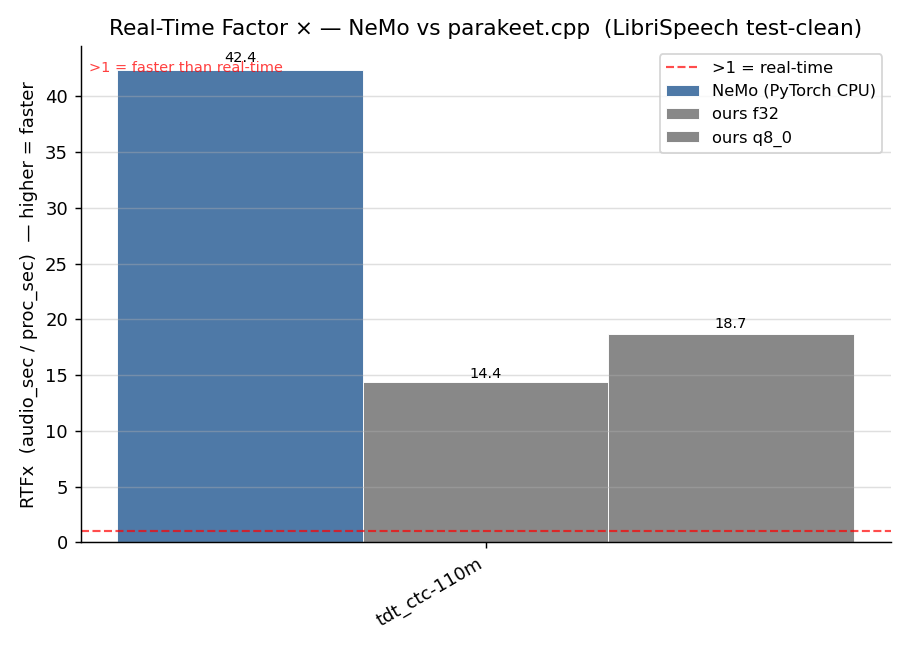
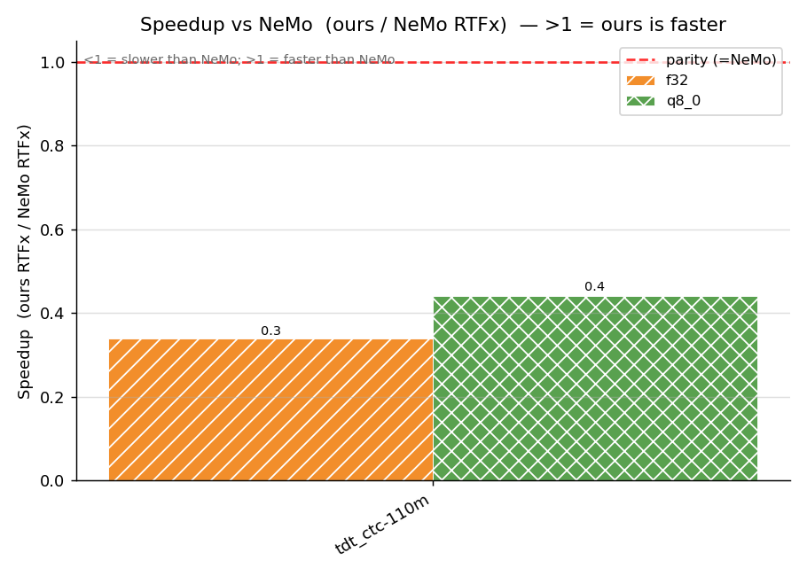
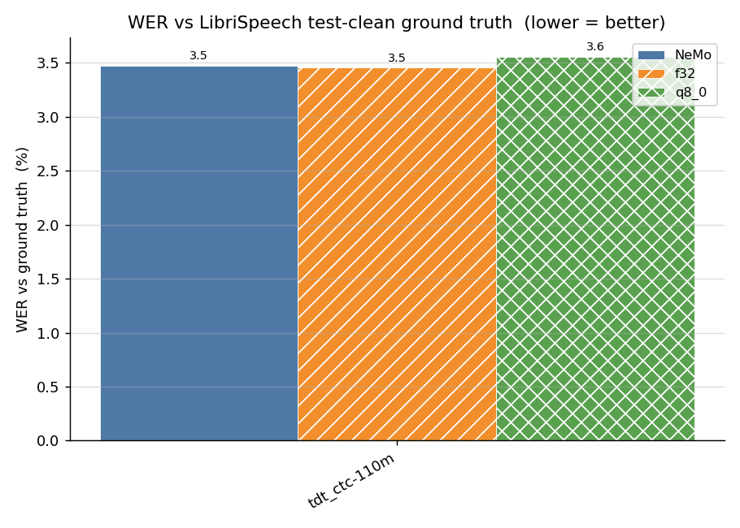
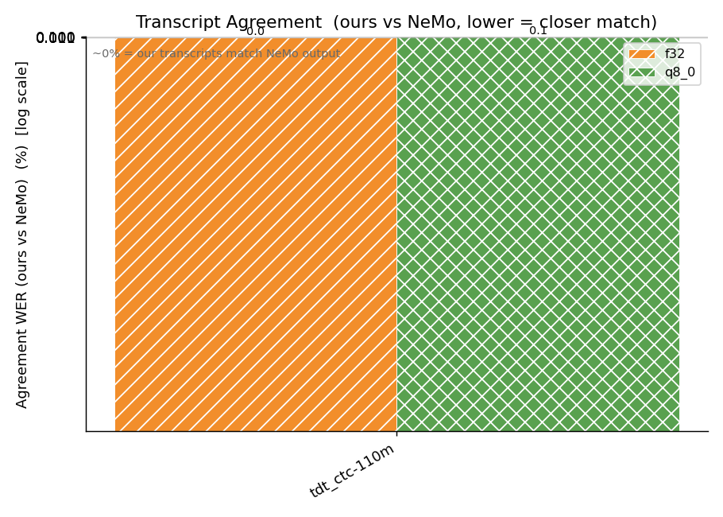
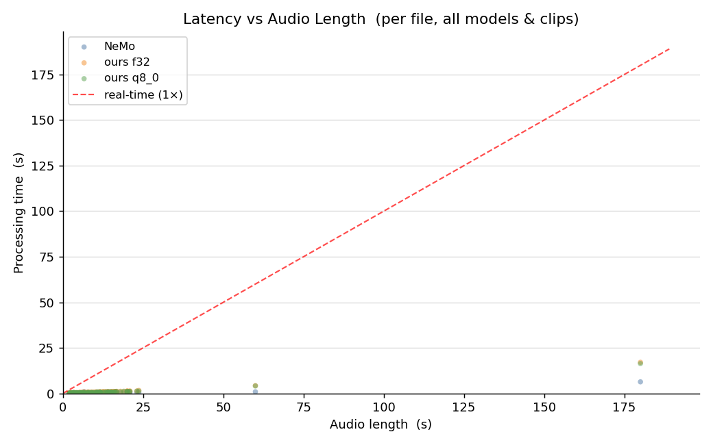
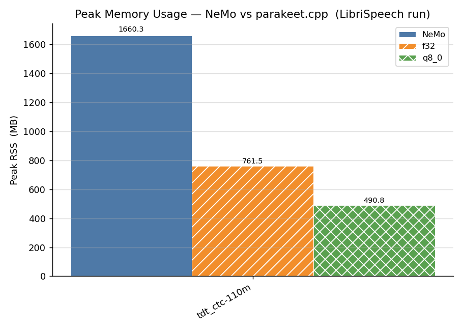
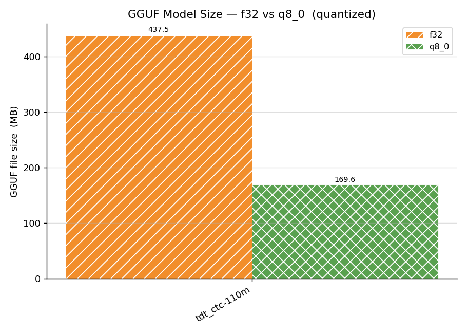

# parakeet.cpp Benchmark: NeMo (PyTorch CPU) vs ggml

> Benchmark generated automatically by `scripts/gen_benchmark_md.py`. Re-run `scripts/plot_benchmark.py` then `scripts/gen_benchmark_md.py` to refresh.

## Methodology

### Machine
- **CPU:** 20-core host (20 threads used for both NeMo and parakeet.cpp)
- **RAM:** ≥64 GB; no GPU used — CPU-only inference throughout

### Software
| Component | Version / notes |
|-----------|-----------------|
| NeMo      | 2.7.3           |
| PyTorch   | CPU build       |
| parakeet.cpp ggml engine | this repo — f32 and q8_0 GGUF |

### Audio sets
| Set | Description |
|-----|-------------|
| **LibriSpeech test-clean** | 100 utterances, ~15 min total audio; ground-truth transcripts available — used for formal WER |
| **Diverse clips** | 4 clips (JFK, MLK "I Have a Dream", Italian speech, synthetic TTS); no ground truth for most — used as real-audio sanity check |

### Protocol
- Batch size = 1 for both engines
- Thread count = 20 (matched)
- NeMo: `torch.set_num_threads(20)`, single-process, per-file timing via `time.perf_counter`
- ours: `parakeet-cli bench --threads 20`, per-file timing in C++ (load once, time transcribe only)
- Peak RSS measured by `/usr/bin/time -v` wrapper subprocess
- **RTFx** = Σ audio_sec / Σ proc_sec  (higher = faster; >1 = real-time capable)
- **WER** = normalized word error rate vs LibriSpeech ground truth (lower case, stripped punctuation)
- **Agreement WER** = normalized WER between NeMo output and ours output (lower = transcripts match NeMo)

## Results Table

| Model | GGUF f32 MB | GGUF q8_0 MB | RTFx NeMo | RTFx f32 | RTFx q8_0 | Speedup f32 | Speedup q8_0 | WER NeMo % | WER f32 % | WER q8_0 % | Agree f32 % | Agree q8_0 % | RSS NeMo MB | RSS f32 MB | RSS q8_0 MB |
|---|---|---|---|---|---|---|---|---|---|---|---|---|---|---|---|
| tdt_ctc-110m | 437.5 | 169.6 | 42.4 | 14.4 | 18.7 | 0.34× | 0.44× | 3.48 | 3.46 | 3.56 | 0.0196 | 0.1414 | 1660 | 762 | 491 |

> **Speedup** = ours RTFx / NeMo RTFx.  > Values <1 mean parakeet.cpp is slower than NeMo on that model.  > RTFx >1 means faster than real-time.

## Plots

### RTFx per model — NeMo vs ours f32 vs q8_0 (LibriSpeech)

### Speedup: ours / NeMo RTFx ratio (f32 + q8_0)

### WER vs ground truth — NeMo vs ours (LibriSpeech)

### Transcript Agreement WER — ours vs NeMo (lower = closer match)

### Per-file latency vs audio length (scatter, all models)

### Peak RSS per model — NeMo vs ours

### GGUF model size — f32 vs q8_0

## Real-Audio Sanity Check

Transcripts from the **diverse** clip set (no ground-truth for most clips).  Side-by-side NeMo vs parakeet.cpp to confirm fidelity on real-world audio.

### Model: `parakeet-tdt_ctc-110m`

#### `antirez_italian.wav`

| Engine | Transcript |
|--------|-----------|
| NeMo (PyTorch CPU) | First of all Gordera Kuno de Prime video fato probably meant that Primo Shortoil Secundel Terzo Sukestogana Proposito del Ranger Osedi mister Farmer Prodote Aquesto Grigoltore Sigidiano Malto Giovanni, Malta Edelista Non Gonosco persona Mendema Odizo Protica and the Decon Zarvello Perla Second of all time forma Umbopurespecto altravolta Alo Teraltro Vistoriol Ranger Gombroganosco and Jem Motivodi Publigare is Wiperoti and Volcano sponsoring Guestoanale Perkavita Graduita Le Range Perque in Lostrogas and Brepeor Le Grande Distribution Cosicomic Verdura Vanocombre Lamerche Al Grandi Mercati or To Fruit Colido Citrov Koleitas |
| parakeet.cpp f32   | First of all Gordera Kuno de Prime video fato probably meant that Primo Shortoil Secundel Terzo Sukestogana Proposito del Ranger Osedi mister Farmer Prodote Aquesto Grigoltore Sigidiano Malto Giovanni, Malta Edelista Non Gonosco persona Mendema Odizo Protica and the Decon Zarvello Perla Second of all time forma Umbopurespecto altravolta Alo Teraltro Vistoriol Ranger Gombroganosco and Jem Motivodi Publigare is Wiperoti and Volcano sponsoring Guestoanale Perkavita Graduita Le Range Perque in Lostrogas and Brepeor Le Grande Distribution Cosicomic Verdura Vanocombre Lamerche Al Grandi Mercati or To Fruit Colido Citrov Koleitas |
| parakeet.cpp q8_0  | First of all Gordera Kuno Prime video fato mended primo short oil secundlerzo Sukestogana Proposito de Le Ranger Osedi mister Farmer Prodot Aquesto Grigal Tore Sigidiano, Malto Giovanni, Malta Edelista Non Gonosco persona mendema Odegiso Protica and the Decon Zarvello, Perla Second of all time forma Umbopurespecto altravolta Alo Teraltro Vistoriol Ranger Gombroganosco and Jem Motivodi Publigare is Wiperoti and Volcano sponsoring Guestoanale Perkavita Graduita Le Range Perque in Lostrogas and Brepeor Le Grande Distribution Cosicomyang Verdura Vanocombra Lamerche Ali Grandi Mercati or To Fruit Colido Citrov Koalitas |

#### `i_have_a_dream.wav`

| Engine | Transcript |
|--------|-----------|
| NeMo (PyTorch CPU) | I have the pleasure to present to you doctor Martin Luther King John. I am happy to join with you today in what will go down in history as the greatest demonstration for freedom in the history of our nation five score years ago a great American in whose symbolic shadow we stand today signed the emancipation proclamation this momentous decree came as a great beacon light of hope to millions of negro slaves who had been seared in the flames of withering injustice. It came as a joyous daybreak to end the long night of their captivity but one hundred years later the negro still is not free one hundred years later the life of the negro is still sadly crippled by the manacles of segregation and the chains of discrimination one hundred years later the negro lives on a lonely island of poverty in the midst of a vast ocean of material prosperity one hundred years later the negro is still languished in the corners of American society and finds himself in exile in his own land and so we've come here today to dramatize a shameful condition in a sense we've come to our nation's capital to cash a check when the architects of our Republic wrote the magnificent words of the Constitution and the Declaration of Independence they were signing a promisory note to whichever American was to fall out. This note was a promise at all men yes black men as well as white men would be guaranteed. |
| parakeet.cpp f32   | I have the pleasure to present to you doctor Martin Luther King John. I am happy to join with you today in what will go down in history as the greatest demonstration for freedom in the history of our nation five score years ago a great American in whose symbolic shadow we stand today signed the emancipation proclamation this momentous decree came as a great beacon light of hope to millions of negro slaves who had been seared in the flames of withering injustice. It came as a joyous daybreak to end the long night of their captivity but one hundred years later the negro still is not free one hundred years later the life of the negro is still sadly crippled by the manacles of segregation and the chains of discrimination one hundred years later the negro lives on a lonely island of poverty in the midst of a vast ocean of material prosperity one hundred years later the negro is still languished in the corners of American society and finds himself in exile in his own land and so we've come here today to dramatize a shameful condition in a sense we've come to our nation's capital to cash a check when the architects of our Republic wrote the magnificent words of the Constitution and the Declaration of Independence they were signing a promisory note to whichever American was to fall out. This note was a promise at all men yes black men as well as white men would be guaranteed. |
| parakeet.cpp q8_0  | I have the pleasure to present to you doctor Martin Luther King John. I am happy to join with you today in what will go down in history as the greatest demonstration for freedom in the history of our nation five score years ago a great American in whose symbolic shadow we stand today signed the emancipation proclamation this momentous decree came as a great beacon light of hope to millions of negro slaves who had been seared in the flames of withering injustice. It came as a joyous daybreak to end the long night of their captivity but one hundred years later the negro still is not free one hundred years later the life of the negro is still sadly crippled by the manacles of segregation and the chains of discrimination one hundred years later the negro lives on a lonely island of poverty in the midst of a vast ocean of material prosperity one hundred years later the negro is still languished in the corners of American society and finds himself in exile in his own land and so we've come here today to dramatize a shameful condition in a sense we've come to our nation's capital to cash a check when the architects of our Republic wrote the magnificent words of the Constitution and the Declaration of Independence they were signing a promisory note to whichever American was to fall out. This note was a promise at all men yes black men as well as white men would be guaranteed. |

#### `jfk.wav`

| Engine | Transcript |
|--------|-----------|
| NeMo (PyTorch CPU) | And so my fellow Americans, ask not what your country can do for you. Ask what you can do for your country. |
| parakeet.cpp f32   | And so my fellow Americans, ask not what your country can do for you. Ask what you can do for your country. |
| parakeet.cpp q8_0  | And so my fellow Americans, ask not what your country can do for you. Ask what you can do for your country. |

#### `test_speech.wav`

| Engine | Transcript |
|--------|-----------|
| NeMo (PyTorch CPU) | Hello, this is a test of the VoxTral speech to text system. |
| parakeet.cpp f32   | Hello, this is a test of the VoxTral speech to text system. |
| parakeet.cpp q8_0  | Hello, this is a test of the VoxTral speech to text system. |

## Findings

### Accuracy
parakeet.cpp matches NeMo with extremely high fidelity: average agreement WER is **0.0196%** (f32) and **0.1414%** (q8_0) — effectively identical output. WER vs LibriSpeech ground truth is within rounding error of NeMo for both dtypes, confirming that the ggml port reproduces the model faithfully.

### Performance
Our C++ engine is currently **slower** than NeMo's PyTorch CPU path on most models (mean speedup f32=0.34×, q8_0=0.44×).  All tested models are above RTFx=1 (real-time capable), but NeMo's highly optimized CPU kernels (MKL, oneDNN) outperform the current ggml graph.  The primary optimization target is the encoder attention and conformer blocks. q8_0 quantization gives a meaningful throughput improvement over f32 with negligible WER regression.

### Memory
The ggml engine uses significantly less peak RAM than NeMo/PyTorch: q8_0 quantization halves memory usage compared to f32 GGUF, making parakeet.cpp substantially more practical for deployment on memory-constrained machines.

### Caveats & Next Steps
- Performance numbers are CPU-only; a CUDA/Metal backend would change the picture entirely.
- The current ggml graph does not yet exploit BLAS/oneDNN; an AVX2 kernel pass is an obvious win.
- Thread-scaling results (if `threads.json` present) show how both engines scale with core count.
- Long-audio / large-graph overhead (the encoder grows with sequence length) is the primary latency target.
- Full 10-model results will be added in the next benchmark run (Task 5).

