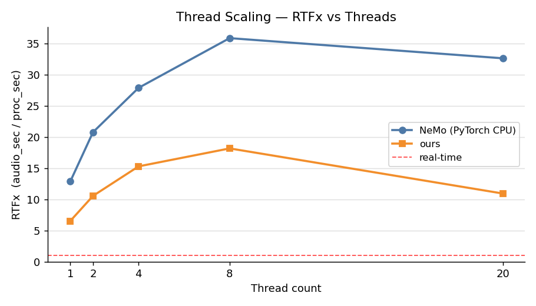

# parakeet.cpp Benchmark: NeMo (PyTorch CPU) vs ggml

> Benchmark generated automatically by `scripts/gen_benchmark_md.py`. Re-run `scripts/plot_benchmark.py` then `scripts/gen_benchmark_md.py` to refresh.

## Methodology

### Machine
- **CPU:** 20-core host (20 threads used for both NeMo and parakeet.cpp)
- **RAM:** ≥64 GB; no GPU used — CPU-only inference throughout

### Software
| Component | Version / notes |
|-----------|-----------------|
| NeMo      | 2.7.3           |
| PyTorch   | CPU build       |
| parakeet.cpp ggml engine | this repo — f32 and q8_0 GGUF |

### Audio sets
| Set | Description |
|-----|-------------|
| **LibriSpeech test-clean** | 100 utterances, ~15 min total audio; ground-truth transcripts available — used for formal WER |
| **Diverse clips** | 4 clips (JFK, MLK "I Have a Dream", Italian speech, synthetic TTS); no ground truth for most — used as real-audio sanity check |

### Protocol
- Batch size = 1 for both engines
- Thread count = 20 (matched)
- NeMo: `torch.set_num_threads(20)`, single-process, per-file timing via `time.perf_counter`
- ours: `parakeet-cli bench --threads 20`, per-file timing in C++ (load once, time transcribe only)
- Peak RSS measured by `/usr/bin/time -v` wrapper subprocess
- **RTFx** = Σ audio_sec / Σ proc_sec  (higher = faster; >1 = real-time capable)
- **WER** = normalized word error rate vs LibriSpeech ground truth (lower case, stripped punctuation)
- **Agreement WER** = normalized WER between NeMo output and ours output (lower = transcripts match NeMo)

## Results Table

| Model | GGUF f32 MB | GGUF q8_0 MB | RTFx NeMo | RTFx f32 | RTFx q8_0 | Speedup f32 | Speedup q8_0 | WER NeMo % | WER f32 % | WER q8_0 % | Agree f32 % | Agree q8_0 % | RSS NeMo MB | RSS f32 MB | RSS q8_0 MB |
|---|---|---|---|---|---|---|---|---|---|---|---|---|---|---|---|
| ctc-0.6b | 2322.7 | 834.9 | 21.9 | 5.6 | 9.1 | 0.26× | 0.41× | 4.33 | 4.33 | 4.33 | 0.0000 | 0.0175 | 5472 | 2653 | 1159 |
| ctc-1.1b | 4053.8 | 1455.6 | 13.0 | 3.3 | 5.4 | 0.25× | 0.41× | 4.73 | 4.75 | 4.75 | 0.0222 | 0.0444 | 8939 | 4384 | 1780 |
| rnnt-0.6b | 2352.8 | 862.0 | 18.2 | 4.2 | 6.4 | 0.23× | 0.35× | 4.41 | 4.41 | 4.41 | 0.0000 | 0.0000 | 5542 | 2682 | 1185 |
| rnnt-1.1b | 4083.9 | 1482.7 | 10.1 | 2.5 | 3.4 | 0.25× | 0.34× | 4.26 | 4.26 | 4.22 | 0.0000 | 0.0435 | 9007 | 4414 | 1806 |
| tdt-0.6b-v2 | 2357.2 | 862.0 | 15.7 | 3.1 | 8.2 | 0.20× | 0.52× | 3.71 | 3.71 | 3.75 | 0.0000 | 0.4011 | 5526 | 2876 | 1371 |
| tdt-0.6b-v3 | 2392.3 | 897.1 | 16.9 | 5.0 | 7.6 | 0.29× | 0.45× | 3.40 | 3.41 | 3.41 | 0.0143 | 0.0143 | 5622 | 2912 | 1406 |
| tdt-1.1b | 4083.9 | 1482.7 | 11.8 | 3.2 | 5.0 | 0.27× | 0.42× | 2.51 | 2.51 | 2.44 | 0.0000 | 0.0667 | 8981 | 4414 | 1806 |
| tdt_ctc-1.1b | 4087.9 | 1486.7 | 9.8 | 3.1 | 5.0 | 0.31× | 0.51× | 2.61 | 2.55 | 2.54 | 0.0985 | 0.0985 | 8909 | 4418 | 1810 |
| tdt_ctc-110m | 437.5 | 169.6 | 50.1 | 15.8 | 19.0 | 0.32× | 0.38× | 3.48 | 3.46 | 3.56 | 0.0196 | 0.1414 | 1660 | 761 | 491 |
| rt-eou-120m-v1 | 438.3 | 167.8 | 45.9 | 11.2 | 13.6 | 0.24× | 0.30× | 10.92 | 10.92 | 11.00 | 0.0000 | 0.0795 | 1817 | 1140 | 865 |

> **Speedup** = ours RTFx / NeMo RTFx.  > Values <1 mean parakeet.cpp is slower than NeMo on that model.  > RTFx >1 means faster than real-time.

## Plots

### RTFx per model — NeMo vs ours f32 vs q8_0 (LibriSpeech)

### Speedup: ours / NeMo RTFx ratio (f32 + q8_0)

### WER vs ground truth — NeMo vs ours (LibriSpeech)

### Transcript Agreement WER — ours vs NeMo (lower = closer match)

### Per-file latency vs audio length (scatter, all models)

### Peak RSS per model — NeMo vs ours

### GGUF model size — f32 vs q8_0

### Thread scaling — RTFx vs thread count

## Real-Audio Sanity Check

Transcripts from the **diverse** clip set (no ground-truth for most clips).  Side-by-side NeMo vs parakeet.cpp to confirm fidelity on real-world audio.

### Model: `parakeet-ctc-0.6b`

#### `antirez_italian.wav`

| Engine | Transcript |
|--------|-----------|
| NeMo (PyTorch CPU) | first of all conicera one of the primi video go fato probably me the primo shorto oil second deal terzo suquestogan le era proposido de l rangeros si mr farmer product thequesto agric toore sicidiano malto giovan maltoedalista you know nongosco personand dea odejiso pradigaad conz yarvero pera secondavolt time for my un popcular peto alltravolta aloaltro vistoro l rangea cbra n logonosco andon gem motivo di publigitsare suway produot n non aruno sponsor in guestoganale percevacho pububigita gratuita lange perke credo okay in nostrog bos has sebrepeggiore e la grande distributione cosic ormaangegeiic fruto verdura vano combra la merch al i grandi mercati orto frutioido citrova callitas |
| parakeet.cpp f32   | first of all conicera one of the primi video go fato probably me the primo shorto oil second deal terzo suquestogan le era proposido de l rangeros si mr farmer product thequesto agric toore sicidiano malto giovan maltoedalista you know nongosco personand dea odejiso pradigaad conz yarvero pera secondavolt time for my un popcular peto alltravolta aloaltro vistoro l rangea cbra n logonosco andon gem motivo di publigitsare suway produot n non aruno sponsor in guestoganale percevacho pububigita gratuita lange perke credo okay in nostrog bos has sebrepeggiore e la grande distributione cosic ormaangegeiic fruto verdura vano combra la merch al i grandi mercati orto frutioido citrova callitas |
| parakeet.cpp q8_0  | first of all conicera one of the primi video fato probably me the primo shorto oil second deal terzo suquestogan le era proposido de l rangeros si mr farmer product thequesto agric toore sicidiano malto giovan maltoedalista you know nongosco personand dea o dejiso pradigaad con z yarvero pera secondavolt time for my un popcular petal alltravolta aloaltro vistoro l rangea cbra n logonosco andon gem motivo di publigitsa suway produot non aruno sponsor in guestoganale percevacho pububigita gratuita lange perke credo okay in nostrog bos has sebrepeggiore e la grande distributione cosic ormaangegeiic fruto verdura vano cbra la merch al i grandi mercati orto frutioido citrova callitas |

#### `i_have_a_dream.wav`

| Engine | Transcript |
|--------|-----------|
| NeMo (PyTorch CPU) | i have the pleasure to present to you dr martin luther king i am happy to jon with you today in what will go down in history as the greatest demonstration for freedom in the history of our nation five score years ago a great american in whose symbolic shadow we stand today signed the emancipation proclamation this momentous decree came as a great beacon light of hope to millions of negro slaves who had been seared in the flames of withering injustice it came as a joyous daybreak to end the long night of their captivity but one hundred years later the negro still is not free one hundred years later the life of the negro is still sadly crippled by the manacles of segregation and the chains of discrimination one hundred years later the negro lives on a lonely island of poverty in the midst of a vast ocean of material prosperity one hundred years later the negro is still languished in the corners of american society and finds himself in exile in his own land and so we've come here today to dramatize a shameful condition innocence we've come to our nation's capital to cash a check when the architects of our republic wrote the magnificent words of the constitution and the declaration of independence they were signing a promissory not to which every american was to fall this note was a promise that all men yes black men as well as white men would bearanted |
| parakeet.cpp f32   | i have the pleasure to present to you dr martin luther king i am happy to jon with you today in what will go down in history as the greatest demonstration for freedom in the history of our nation five score years ago a great american in whose symbolic shadow we stand today signed the emancipation proclamation this momentous decree came as a great beacon light of hope to millions of negro slaves who had been seared in the flames of withering injustice it came as a joyous daybreak to end the long night of their captivity but one hundred years later the negro still is not free one hundred years later the life of the negro is still sadly crippled by the manacles of segregation and the chains of discrimination one hundred years later the negro lives on a lonely island of poverty in the midst of a vast ocean of material prosperity one hundred years later the negro is still languished in the corners of american society and finds himself in exile in his own land and so we've come here today to dramatize a shameful condition innocence we've come to our nation's capital to cash a check when the architects of our republic wrote the magnificent words of the constitution and the declaration of independence they were signing a promissory not to which every american was to fall this note was a promise that all men yes black men as well as white men would be gar |
| parakeet.cpp q8_0  | i have the pleasure to present to you dr martin luther king i am happy to jon with you today in what will go down in history as the greatest demonstration for freedom in the history of our nation five score years ago a great american in whose symbolic shadow we stand today signed the emancipation proclamation this momentous decree came as a great beacon light of hope to millions of negro slaves who had been seared in the flames of withering injustice it came as a joyous daybreak to end the long night of their captivity but one hundred years later the negro still is not free one hundred years later the life of the negro is still sadly crippled by the manacles of segregation and the chains of discrimination one hundred years later the negro lives on a lonely island of poverty in the midst of a vast ocean of material prosperity one hundred years later the negro is still languished in the corners of american society and finds himself in exile in his own land and so we've come here today to dramatize a shameful condition innocence we've come to our nation's capital to cash a check when the architects of our republic wrote the magnificent words of the constitution and the declaration of independence they were signing a promissory not to which every american was to fall this note was a promise that all men yes black men as well as white men would be gar |

#### `jfk.wav`

| Engine | Transcript |
|--------|-----------|
| NeMo (PyTorch CPU) | and so my fellow americans ask not what your country can do for you ask what you can do for your country |
| parakeet.cpp f32   | and so my fellow americans ask not what your country can do for you ask what you can do for your country |
| parakeet.cpp q8_0  | and so my fellow americans ask not what your country can do for you ask what you can do for your country |

#### `test_speech.wav`

| Engine | Transcript |
|--------|-----------|
| NeMo (PyTorch CPU) | hello this is a test of the voxtrol speech to text system |
| parakeet.cpp f32   | hello this is a test of the voxtrol speech to text system |
| parakeet.cpp q8_0  | hello this is a test of the voxtrl speech to text system |

### Model: `parakeet-ctc-1.1b`

#### `antirez_italian.wav`

| Engine | Transcript |
|--------|-----------|
| NeMo (PyTorch CPU) | first of all couldaorder i one of the primie video fat probably went the primo short oil second or third so so cestogana leera proposito de langeros the mr farmer producted a questesto agricultore sigidiano malto giovan maltoedalista you nonosco person and mendema o degiso pic anda d conziar velo perla second of all time for unpopu car respect to ultravolta alora traaltro vistoroa rangeaombro nol loconosco and anjem motivo d publigitale is who i product yeah and an aruno sponsor in guestoanale perquvachcio buligita gratuita l range perqu grarado okay inllstrogios has andrepeggiore la grande distributiona cicom or may anpically fr verdura van no combra la merch al i grandi mercati oro fruit t callido citrova collitas |
| parakeet.cpp f32   | first of all couldaorder i one of the primie video fat probably went the primo short oil second or third so so cestogana leera proposito de langeros the mr farmer producted a questesto agricultore sigidiano malto giovan maltoedalista you nonosco person and mendema o degiso pic anda d conziar velo perla second of all time for unpopu car respect to ultravolta alora traaltro vistoroa rangeaombro nol loconosco and anjem motivo d publigitale is who i product yeah and an aruno sponsor in guestoanale perquvachcio buligita gratuita l range perqu grarado okay inllstrogios has andrepeggiore la grande distributiona cicom or may anpically fr verdura van no combra la merch al i grandi mercati oro fruit t callido citrova collitas |
| parakeet.cpp q8_0  | first of all couldunaorder i one of the primie video fat probably went the primo short oil second or third so so cestogana leera proposito de langeros the mr farmer producted a questest to agricultore sigidiano malto giovan maltoedalista you nonosco person and mendema o degiso pic anda d conziar velo perla second of all time for unpopu car respect to ultravolta alora traaltro vistoroa rangeaombro nol loconosco and anjem motivo d publigitale is who i product yeah and an aruno sponsor in guestoanale perquvachcio buligita gratuita l range perqu grarado okay inllstrogos has andrepeggiore la grande distributiona cicom or may anpically fr verdura van no combra la merch al i grandi mercati oro fruit t callido citrova collitas |

#### `i_have_a_dream.wav`

| Engine | Transcript |
|--------|-----------|
| NeMo (PyTorch CPU) | i have the pleasure to present to you dr martin luther king i am happy to join with you today in what will go down in history as the greatest demonstration for freedom in the history of our nation five score years ago a great american in whose symbolic shadow we stand today signed the emancipation proclamation this momentous decree came as a great beacon light of hope to millions of negro slaves who had been seared in the flames of withering injustice it came as a joyous daybreak to end the long night of their captivity but one hundred years later the negro still is not free one hundred years later the life of the negro is still sadly crippled by the manacles of segregation and the chains of discrimination one hundred years later the negro lives on a lonely island of poverty in the midst of a vast ocean of material prosperity one hundred years later the negro has still languished in the corners of american society and finds himself in exile in his own land and so we've come here today to dramatize a shameful condition in a sense we've come to our nation's capital to cash a check when the architects of our republic wrote the magnificent words of the constitution and the declaration of independence they were signing a promissory note to which every american was to fall heir this note was a promise that all men yes black men as well as white men would be guaranteed |
| parakeet.cpp f32   | i have the pleasure to present to you dr martin luther king i am happy to join with you today in what will go down in history as the greatest demonstration for freedom in the history of our nation five score years ago a great american in whose symbolic shadow we stand today signed the emancipation proclamation this momentous decree came as a great beacon light of hope to millions of negro slaves who had been seared in the flames of withering injustice it came as a joyous daybreak to end the long night of their captivity but one hundred years later the negro still is not free one hundred years later the life of the negro is still sadly crippled by the manacles of segregation and the chains of discrimination one hundred years later the negro lives on a lonely island of poverty in the midst of a vast ocean of material prosperity one hundred years later the negro has still languished in the corners of american society and finds himself in exile in his own land and so we've come here today to dramatize a shameful condition in a sense we've come to our nation's capital to cash a check when the architects of our republic wrote the magnificent words of the constitution and the declaration of independence they were signing a promissory note to which every american was to fall heir this note was a promise that all men yes black men as well as white men would be guaranteed |
| parakeet.cpp q8_0  | i have the pleasure to present to you dr martin luther king i am happy to join with you today in what will go down in history as the greatest demonstration for freedom in the history of our nation five score years ago a great american in whose symbolic shadow we stand today signed the emancipation proclamation this momentous decree came as a great beacon light of hope to millions of negro slaves who had been seared in the flames of withering injustice it came as a joyous daybreak to end the long night of their captivity but one hundred years later the negro still is not free one hundred years later the life of the negro is still sadly crippled by the manacles of segregation and the chains of discrimination one hundred years later the negro lives on a lonely island of poverty in the midst of a vast ocean of material prosperity one hundred years later the negro has still languished in the corners of american society and finds himself in exile in his own land and so we've come here today to dramatize a shameful condition in a sense we've come to our nation's capital to cash a check when the architects of our republic wrote the magnificent words of the constitution and the declaration of independence they were signing a promissory note to which every american was to fall heir this note was a promise that all men yes black men as well as white men would be guaranteed |

#### `jfk.wav`

| Engine | Transcript |
|--------|-----------|
| NeMo (PyTorch CPU) | and so my fellow americans ask not what your country can do for you ask what you can do for your country |
| parakeet.cpp f32   | and so my fellow americans ask not what your country can do for you ask what you can do for your country |
| parakeet.cpp q8_0  | and so my fellow americans ask not what your country can do for you ask what you can do for your country |

#### `test_speech.wav`

| Engine | Transcript |
|--------|-----------|
| NeMo (PyTorch CPU) | hello this is a test of the voxtstrol speech to text system |
| parakeet.cpp f32   | hello this is a test of the voxtstrol speech to text system |
| parakeet.cpp q8_0  | hello this is a test of the voxtstrol speech to text system |

### Model: `parakeet-rnnt-0.6b`

#### `antirez_italian.wav`

| Engine | Transcript |
|--------|-----------|
| NeMo (PyTorch CPU) | force primivido fato probably primo shortoil secondal terzo suquestogana le era proposito de la rangero cedi mister farmer producted a questo gricultore sicidiano molto giovane molto idalista non gonosco persona mendema odegiso predicanda dicon zi yarverlo per la seconda voltai informa unbopucarispe volta altro vistriole range motivo di published ari sui producu noncuno sponsor in questoganale perkevacu publishta graduate a lerange perque credo que inostruga sembrepeggiore e le grande distribution verduva no combra la merch alla i grandi mercati or to fruiti coridova sitrova qualitas |
| parakeet.cpp f32   | force primivido fato probably primo shortoil secondal terzo suquestogana le era proposito de la rangero cedi mister farmer producted a questo gricultore sicidiano molto giovane molto idalista non gonosco persona mendema odegiso predicanda dicon zi yarverlo per la seconda voltai informa unbopucarispe volta altro vistriole range motivo di published ari sui producu noncuno sponsor in questoganale perkevacu publishta graduate a lerange perque credo que inostruga sembrepeggiore e le grande distribution verduva no combra la merch alla i grandi mercati or to fruiti coridova sitrova qualitas |
| parakeet.cpp q8_0  | force primivido fato mende primo shortoil second ale era proposito de la rangero cedi mister farmer producted a questo gricultore sicidiano molto giovane molto idalista non gonosco persona mendema odegiso predicanda dicon zi yarverlo per la seconda voltai informa unbopucarispe volta altro vistorio la range combro no logonosco and on gemotivo di publigid zare sui produ noncuno sponsor in questoganale perkevacu publishta graduate a lerange perque credo que inostruga sembrepeggiore e le grande distribution verduva no combra la merch alla i grandi mercati or to fruiti coridova sitrova qualitas |

#### `i_have_a_dream.wav`

| Engine | Transcript |
|--------|-----------|
| NeMo (PyTorch CPU) | i have the pleasure to present to you dr martin luther king i am happy to join with you today in what will go down in history as the greatest demonstration for freedom in the history of our nation five score years ago a great american in whose symbolic shadow we stand today signed the emancipation proclamation this momentous decree came as a great beacon light of hope to millions of negro slaves who had been seared in the flames of withering injustice it came as a joyous daybreak to end the long night of their captivity but one hundred years later the negro still is not free one hundred years later the life of the negro is still sadly crippled by the manacles of segregation and the chains of discrimination one hundred years later the negro lives on a lonely island of poverty in the midst of a vast ocean of material prosperity one hundred years later the negro is still languished in the corners of american society and finds himself in exile in his own land so we've come here today to dramatize a shameful condition in a sense we've come to our nation's capital to cash a check when the architects of our republic wrote the magnificent words of the constitution and the declaration of independence they were signing a promissory note to whichever american was to fall this note was a promise that all men yes black men as well as white men would be guaranteed |
| parakeet.cpp f32   | i have the pleasure to present to you dr martin luther king i am happy to join with you today in what will go down in history as the greatest demonstration for freedom in the history of our nation five score years ago a great american in whose symbolic shadow we stand today signed the emancipation proclamation this momentous decree came as a great beacon light of hope to millions of negro slaves who had been seared in the flames of withering injustice it came as a joyous daybreak to end the long night of their captivity but one hundred years later the negro still is not free one hundred years later the life of the negro is still sadly crippled by the manacles of segregation and the chains of discrimination one hundred years later the negro lives on a lonely island of poverty in the midst of a vast ocean of material prosperity one hundred years later the negro is still languished in the corners of american society and finds himself in exile in his own land so we've come here today to dramatize a shameful condition in a sense we've come to our nation's capital to cash a check when the architects of our republic wrote the magnificent words of the constitution and the declaration of independence they were signing a promissory note to whichever american was to fall this note was a promise that all men yes black men as well as white men would be guaranteed |
| parakeet.cpp q8_0  | i have the pleasure to present to you dr martin luther king i am happy to join with you today in what will go down in history as the greatest demonstration for freedom in the history of our nation five score years ago a great american in whose symbolic shadow we stand today signed the emancipation proclamation this momentous decree came as a great beacon light of hope to millions of negro slaves who had been seared in the flames of withering injustice it came as a joyous daybreak to end the long night of their captivity but one hundred years later the negro still is not free one hundred years later the life of the negro is still sadly crippled by the manacles of segregation and the chains of discrimination one hundred years later the negro lives on a lonely island of poverty in the midst of a vast ocean of material prosperity one hundred years later the negro is still languished in the corners of american society and finds himself in exile in his own land so we've come here today to dramatize a shameful condition in a sense we've come to our nation's capital to cash a check when the architects of our republic wrote the magnificent words of the constitution and the declaration of independence they were signing a promissory note to whichever american was to fall this note was a promise that all men yes black men as well as white men would be guaranteed |

#### `jfk.wav`

| Engine | Transcript |
|--------|-----------|
| NeMo (PyTorch CPU) | and so my fellow americans ask not what your country can do for you ask what you can do for your country |
| parakeet.cpp f32   | and so my fellow americans ask not what your country can do for you ask what you can do for your country |
| parakeet.cpp q8_0  | and so my fellow americans ask not what your country can do for you ask what you can do for your country |

#### `test_speech.wav`

| Engine | Transcript |
|--------|-----------|
| NeMo (PyTorch CPU) | hello this is a test of the voxtrill speech to text system |
| parakeet.cpp f32   | hello this is a test of the vauxtroll speech to text system |
| parakeet.cpp q8_0  | hello this is a test of the vauxtroll speech to text system |

### Model: `parakeet-rnnt-1.1b`

#### `antirez_italian.wav`

| Engine | Transcript |
|--------|-----------|
| NeMo (PyTorch CPU) | forseucono rigordera que uno dei primi video queo fato probabenti primo shorto il secondal terzo suquesto canale era proposido della rangerosse di mister farmer produceda questo agricultore sicidiano molto giovane molto i delista que io non gonosco persona mendema o degiso prodiganda di con sigarvelo per la seconda volta informa un popucciare espevolta alora ter altro vistorio la rangeare combro nolo conosco en ungem motivo di publigitare y suae produdottie non vaccio non arcuno sponsor inquesto canale perque vaccio publigita gratuita le range per que credo que in nostrogi posia sembre peggiore e la grande distribuzione cosi com ermur mayang epiculi fruito verdurava no cumbra i la merche alla ai grandi mercati orto fruti corid si trova qualitas |
| parakeet.cpp f32   | forseucono rigordera que uno dei primi video queo fato probabenti primo shorto il secondal terzo suquesto canale era proposido della rangerosse di mister farmer produceda questo agricultore sicidiano molto giovane molto i delista que io non gonosco persona mendema o degiso prodiganda di con sigarvelo per la seconda volta informa un popucciare espevolta alora ter altro vistorio la rangeare combro nolo conosco en ungem motivo di publigitare y suae produdottie non vaccio non arcuno sponsor inquesto canale perque vaccio publigita gratuita le range per que credo que in nostrogi posia sembre peggiore e la grande distribuzione cosi com ermur mayang epiculi fruito verdurava no cumbra i la merche alla ai grandi mercati orto fruti corid si trova qualitas |
| parakeet.cpp q8_0  | forseucono rigordera que uno dei primi video queo fato probabenti primo shorto il secondal terzo suquesto canale era proposido della rangerosse di mister farmer produceda questo agricultore sicidiano molto giovane molto i delista que io non gonosco persona mendema o degiso prodiganda di con sigarvelo per la seconda volta informa un popucciare espevolta alora ter altro vistorio la rangea de combro nolo conosco en ungem motivo di publigitare y suae produdottie non vaccio non arcuno sponsor inquesto canale perque vaccio publigita gratuita le range per que credo que in nostruci posia sembre peggiore e la grande distribuzione cosi com ermur mayang epiculi fruito verdurava no cumbra i la merche alla ai grandi mercati orto fruti corid si trova qualitas |

#### `i_have_a_dream.wav`

| Engine | Transcript |
|--------|-----------|
| NeMo (PyTorch CPU) | i have the pleasure to present to you dr martin luther king i am happy to john with you today in history as the greatest demonstration freedom in the history of our nation five years ago a great american in whose symbolic shadow we stand today the emancipation proclamation this momentous decree came as a grand beacon light of hope to millions of negro slaves who had been seared in the flames of withering injustice it came as a joyous daybreak to end the long night of their captivity but one hundred years later the negro still is not free one hundred years later the life of the negro is still sadly crippled by the manacles of segregation and the chains of discrimination one hundred years later the negro lives on a lonely island of poverty in the midst of a vast ocean of material prosperity one hundred years later the negro is still languished in the corners of american society and finds himself in exile in his own land so we've come here today to dramatize a shameful condition in a sense we've come to our nation's capital to cash a check when the architects of our republic wrote the magnificent words of the constitution and the declaration of independence they was signing a promise or a note to which every american was to fall this note was a promise that all men yes black men as well as white men would be guaranteed |
| parakeet.cpp f32   | i have the pleasure to present to you dr martin luther king i am happy to john with you today in history as the greatest demonstration freedom in the history of our nation five years ago a great american in whose symbolic shadow we stand today the emancipation proclamation this momentous decree came as a grand beacon light of hope to millions of negro slaves who had been seared in the flames of withering injustice it came as a joyous daybreak to end the long night of their captivity but one hundred years later the negro still is not free one hundred years later the life of the negro is still sadly crippled by the manacles of segregation and the chains of discrimination one hundred years later the negro lives on a lonely island of poverty in the midst of a vast ocean of material prosperity one hundred years later the negro is still languished in the corners of american society and finds himself in exile in his own land so we've come here today to dramatize a shameful condition in a sense we've come to our nation's capital to cash a check when the architects of our republic wrote the magnificent words of the constitution and the declaration of independence they was signing a promise or a note to which every american was to fall this note was a promise that all men yes black men as well as white men would be guaranteed |
| parakeet.cpp q8_0  | i have the pleasure to present to you dr martin luther king i am happy to john with you today in history as the greatest demonstration freedom in the history of our nation five years ago a great american in whose symbolic shadow we stand today the emancipation proclamation this momentous decree came as a grand beacon light of hope to millions of negro slaves who had been seared in the flames of withering injustice it came as a joyous daybreak to end the long night of their captivity but one hundred years later the negro still is not free one hundred years later the life of the negro is still sadly crippled by the manacles of segregation and the chains of discrimination one hundred years later the negro lives on a lonely island of poverty in the midst of a vast ocean of material prosperity one hundred years later the negro is still languished in the corners of american society and finds himself in exile in his own land so we've come here today to dramatize a shameful condition in a sense we've come to our nation's capital to cash a check when the architects of our republic wrote the magnificent words of the constitution and the declaration of independence they was signing a promise or a note to which every american was to fall this note was a promise that all men yes black men as well as white men would be guaranteed |

#### `jfk.wav`

| Engine | Transcript |
|--------|-----------|
| NeMo (PyTorch CPU) | and so my fellow americans ask not what your country can do for you ask what you can do for your country |
| parakeet.cpp f32   | and so my fellow americans ask not what your country can do for you ask what you can do for your country |
| parakeet.cpp q8_0  | and so my fellow americans ask not what your country can do for you ask what you can do for your country |

#### `test_speech.wav`

| Engine | Transcript |
|--------|-----------|
| NeMo (PyTorch CPU) | hello this is a test of the voxtroll speech to text system |
| parakeet.cpp f32   | hello this is a test of the voxtroll speech to text system |
| parakeet.cpp q8_0  | hello this is a test of the voxtroll speech to text system |

### Model: `parakeet-tdt-0.6b-v2`

#### `antirez_italian.wav`

| Engine | Transcript |
|--------|-----------|
| NeMo (PyTorch CPU) | For some of them that one of the first videos that I first short or second, this proposition of the range of Mr. Farmer products of this agriculture, very idealist that people, but the second respect of the Volta. So, vista range, not with, in a motive, public public and their product, not a sponsor in this sponsor, because it will publish the range. Because the book is very distribution, as well as the verdict, the merch to fruit or two, if you have quality. |
| parakeet.cpp f32   | For some of them that one of the first videos that I first short or second, this proposition of the range of Mr. Farmer products of this agriculture, very idealist that people, but the second respect of the Volta. So, vista range, not with, in a motive, public public and their product, not a sponsor in this sponsor, because it will publish the range. Because the book is very distribution, as well as the verdict, the merch to fruit or two, if you have quality. |
| parakeet.cpp q8_0  | For some of the first videos that I first short or second, this proposition of the range of Mr. Farmer products of this agriculture, very idealist that people, but the second respect of the behavior. Because you publish the range, because the book is very distribution because we have the merch to fruit or two, if you have quality. |

#### `i_have_a_dream.wav`

| Engine | Transcript |
|--------|-----------|
| NeMo (PyTorch CPU) | I have the pleasure to present to you Dr. Martin Luther King, DR. I am happy to join with you today in what will go down in history as the greatest demonstration for freedom in the history of our nation. Five score years ago, a great American in whose symbolic shadow we stand today signed the Emancipation Proclamation. This momentous decree came as a great beacon light of hope to millions of Negro slaves who had been seared in the flames of withering injustice. It came as a joyous daybreak to end the long night of their captivity. But 100 years later, the Negro still is not free. 100 years later, the life of the Negro is still sadly crippled by the manacles of segregation and the chains of discrimination. 100 years later, the Negro lives on a lonely island of poverty in the midst of a vast ocean of material prosperity. 100 years later, the Negro is still languished in the corners of American society and finds himself in exile in his own land. And so we've come here today to dramatize a shameful condition. In a sense, we've come to our nation's capital to cash a check. When the architects of our republic wrote the magnificent words of the Constitution and the Declaration of Independence, they were signing a promissory note to which every American was to fall heir. This note was a promise that all men, yes, black men as well as white men, would be guaranteed. |
| parakeet.cpp f32   | I have the pleasure to present to you Dr. Martin Luther King, DR. I am happy to join with you today in what will go down in history as the greatest demonstration for freedom in the history of our nation. Five score years ago, a great American in whose symbolic shadow we stand today signed the Emancipation Proclamation. This momentous decree came as a great beacon light of hope to millions of Negro slaves who had been seared in the flames of withering injustice. It came as a joyous daybreak to end the long night of their captivity. But 100 years later, the Negro still is not free. 100 years later, the life of the Negro is still sadly crippled by the manacles of segregation and the chains of discrimination. 100 years later, the Negro lives on a lonely island of poverty in the midst of a vast ocean of material prosperity. 100 years later, the Negro is still languished in the corners of American society and finds himself in exile in his own land. And so we've come here today to dramatize a shameful condition. In a sense, we've come to our nation's capital to cash a check. When the architects of our republic wrote the magnificent words of the Constitution and the Declaration of Independence, they were signing a promissory note to which every American was to fall heir. This note was a promise that all men, yes, black men as well as white men, would be guaranteed. |
| parakeet.cpp q8_0  | I have the pleasure to present to you Dr. Martin Luther King, DR. I am happy to join with you today in what will go down in history as the greatest demonstration for freedom in the history of our nation. Five score years ago, a great American in whose symbolic shadow we stand today signed the Emancipation Proclamation. This momentous decree came as a great beacon light of hope to millions of Negro slaves who had been seared in the flames of withering injustice. It came as a joyous daybreak to end the long night of their captivity. But 100 years later, the Negro still is not free. 100 years later, the life of the Negro is still sadly crippled by the manacles of segregation and the chains of discrimination. 100 years later, the Negro lives on a lonely island of poverty in the midst of a vast ocean of material prosperity. 100 years later, the Negro is still languished in the corners of American society and finds himself in exile in his own land. And so we've come here today to dramatize a shameful condition. In a sense, we've come to our nation's capital to cash a check. When the architects of our republic wrote the magnificent words of the Constitution and the Declaration of Independence, they were signing a promissory note to which every American was to fall heir. This note was a promise that all men, yes, black men as well as white men, would be guaranteed. |

#### `jfk.wav`

| Engine | Transcript |
|--------|-----------|
| NeMo (PyTorch CPU) | And so, my fellow Americans, ask not what your country can do for you, ask what you can do for your country. |
| parakeet.cpp f32   | And so, my fellow Americans, ask not what your country can do for you, ask what you can do for your country. |
| parakeet.cpp q8_0  | And so, my fellow Americans, ask not what your country can do for you, ask what you can do for your country. |

#### `test_speech.wav`

| Engine | Transcript |
|--------|-----------|
| NeMo (PyTorch CPU) | Hello, this is a test of the Voxtral speech-to-text system. |
| parakeet.cpp f32   | Hello, this is a test of the Voxtral speech-to-text system. |
| parakeet.cpp q8_0  | Hello, this is a test of the Voxtral speech-to-text system. |

### Model: `parakeet-tdt-0.6b-v3`

#### `antirez_italian.wav`

| Engine | Transcript |
|--------|-----------|
| NeMo (PyTorch CPU) | Forse qualcuno ricorderà che uno dei primi video che ho fatto, probabilmente il primo short o il secondo, il terzo su questo canale era a proposito delle arance rosse di Mr. Farmer prodotte da questo agricoltore siciliano molto giovane, molto idealista che io non conosco personalmente, ma ho deciso praticamente di consigliarvelo per la seconda volta in forma un po' più chiara rispetto all'altra volta. Allora, tra l'altro, visto che io le arance le compro, non lo conosco e non c'è motivo di pubblicizzare i suoi prodotti e non ho alcuno sponsor in questo canale perché faccio pubblicità gratuita all'arange perché credo che il nostro cibo sia sempre peggiore e la grande distribuzione, così come ormai anche piccoli frutta di verdura vanno a comprare la merce ai grandi mercati ortofrutticoli dove si trova qualità scarica. |
| parakeet.cpp f32   | Forse qualcuno ricorderà che uno dei primi video che ho fatto, probabilmente il primo short o il secondo, il terzo su questo canale era a proposito delle arance rosse di Mr. Farmer prodotte da questo agricoltore siciliano molto giovane, molto idealista che io non conosco personalmente, ma ho deciso praticamente di consigliarvelo per la seconda volta in forma un po' più chiara rispetto all'altra volta. Allora, tra l'altro, visto che io le arance le compro, non lo conosco e non c'è motivo di pubblicizzare i suoi prodotti e non ho alcuno sponsor in questo canale perché faccio pubblicità gratuita all'arange perché credo che il nostro cibo sia sempre peggiore e la grande distribuzione, così come ormai anche piccoli frutta di verdura vanno a comprare la merce ai grandi mercati ortofrutticoli dove si trova qualità scarica. |
| parakeet.cpp q8_0  | Forse qualcuno ricorderà che uno dei primi video che ho fatto, probabilmente il primo short o il secondo, il terzo su questo canale era a proposito delle arance rosse di Mr. Farmer prodotte da questo agricoltore siciliano molto giovane, molto idealista che io non conosco personalmente, ma ho deciso praticamente di consigliarvelo per la seconda volta in forma un po' più chiara rispetto all'altra volta. Allora, tra l'altro, visto che io le arance le compro, non lo conosco e non c'è motivo di pubblicizzare i suoi prodotti e non ho alcuno sponsor in questo canale perché faccio pubblicità gratuita all'arange perché credo che il nostro cibo sia sempre peggiore e la grande distribuzione, così come ormai anche piccoli frutta di verdura vanno a comprare la merce ai grandi mercati ortofrutticoli dove si trova qualità scarica. |

#### `i_have_a_dream.wav`

| Engine | Transcript |
|--------|-----------|
| NeMo (PyTorch CPU) | I have the pleasure to present to you Dr. Martin Luther King. I am happy to join with you today in what will go down in history as the greatest demonstration for freedom in the history of our nation. Five score years ago, a great American in whose symbolic shadow we stand today signed the Emancipation Proclamation. This momentous decree came as a great beacon light of hope to millions of Negro slaves who had been seared in the flames of withering injustice. It came as a joyous daybreak to end the long night of their captivity. But one hundred years later, the Negro still is not free. One hundred years later, the life of the Negro is still sadly crippled by the manacles of segregation and the chains of discrimination. One hundred years later. In the midst of a vast ocean of material prosperity, one hundred years later. And so we've come here today to dramatize a shameful condition. In a sense, we've come to our nation's capital to cash a check. When the architects of our republic wrote the magnificent words of the Constitution and the Declaration of Independence, they were signing a promissory note to which every American was to fall air. This note was a promise that all men, yes, black men as well as white men would be guaranteed. |
| parakeet.cpp f32   | I have the pleasure to present to you Dr. Martin Luther King. I am happy to join with you today in what will go down in history as the greatest demonstration for freedom in the history of our nation. Five score years ago, a great American in whose symbolic shadow we stand today signed the Emancipation Proclamation. This momentous decree came as a great beacon light of hope to millions of Negro slaves who had been seared in the flames of withering injustice. It came as a joyous daybreak to end the long night of their captivity. But one hundred years later, the Negro still is not free. One hundred years later, the life of the Negro is still sadly crippled by the manacles of segregation and the chains of discrimination. One hundred years later. In the midst of a vast ocean of material prosperity, one hundred years later. And so we've come here today to dramatize a shameful condition. In a sense, we've come to our nation's capital to cash a check. When the architects of our republic wrote the magnificent words of the Constitution and the Declaration of Independence, they were signing a promissory note to which every American was to fall air. This note was a promise that all men, yes, black men as well as white men would be guaranteed. |
| parakeet.cpp q8_0  | I have the pleasure to present to you Dr. Martin Luther King. I am happy to join with you today in what will go down in history as the greatest demonstration for freedom in the history of our nation. Five score years ago, a great American in whose symbolic shadow we stand today signed the Emancipation Proclamation. This momentous decree came as a great beacon light of hope to millions of Negro slaves who had been seared in the flames of withering injustice. It came as a joyous daybreak to end the long night of their captivity. But one hundred years later, the Negro still is not free. One hundred years later, the life of the Negro is still sadly crippled by the manacles of segregation and the chains of discrimination. One hundred years later. In the midst of a vast ocean of material prosperity, one hundred years later. And so we've come here today to dramatize a shameful condition. In a sense, we've come to our nation's capital to cash a check. When the architects of our republic wrote the magnificent words of the Constitution and the Declaration of Independence, they were signing a promissory note to which every American was to fall ale. This note was a promise that all men, yes, black men as well as white men would be guaranteed. |

#### `jfk.wav`

| Engine | Transcript |
|--------|-----------|
| NeMo (PyTorch CPU) | And so, my fellow Americans, ask not what your country can do for you, ask what you can do for your country. |
| parakeet.cpp f32   | And so, my fellow Americans, ask not what your country can do for you, ask what you can do for your country. |
| parakeet.cpp q8_0  | And so, my fellow Americans, ask not what your country can do for you, ask what you can do for your country. |

#### `test_speech.wav`

| Engine | Transcript |
|--------|-----------|
| NeMo (PyTorch CPU) | Hello, this is a test of the Voxtrel speech to text system. |
| parakeet.cpp f32   | Hello, this is a test of the Voxtrel speech to text system. |
| parakeet.cpp q8_0  | Hello, this is a test of the Voxtrel speech to text system. |

### Model: `parakeet-tdt-1.1b`

#### `antirez_italian.wav`

| Engine | Transcript |
|--------|-----------|
| NeMo (PyTorch CPU) | forse ocono ricordera queuno de primi video queo fato probabe primo shorto il secondl terzo suquestocanale era proposido del rangeerosse di mister farmer prodoteda questo agricultore sigidiano molto giovane molto i dealista que i non gonosco persona mendema o degiso pro diganda di con zi garvelo per la seconda volta informa un popucarres peto la'ravolta alora terraltro vistorio le rangea de combro nolo conosco engemotivo di publigizare suai prodottia non vaccio non arcono sponsor inquesto canale per que vaccio publigita gratuita le range per que credo que in ostrogi bosia sembrepeggiore e la grande distribuzione cosicoma ange picoli fruito verduravano cumbra i la merche alla ai grandi mercati orto fruti co i dove sitrova qualitas |
| parakeet.cpp f32   | forse ocono ricordera queuno de primi video queo fato probabe primo shorto il secondl terzo suquestocanale era proposido del rangeerosse di mister farmer prodoteda questo agricultore sigidiano molto giovane molto i dealista que i non gonosco persona mendema o degiso pro diganda di con zi garvelo per la seconda volta informa un popucarres peto la'ravolta alora terraltro vistorio le rangea de combro nolo conosco engemotivo di publigizare suai prodottia non vaccio non arcono sponsor inquesto canale per que vaccio publigita gratuita le range per que credo que in ostrogi bosia sembrepeggiore e la grande distribuzione cosicoma ange picoli fruito verduravano cumbra i la merche alla ai grandi mercati orto fruti co i dove sitrova qualitas |
| parakeet.cpp q8_0  | forse ocono ricordera queuno de primi video queo fato propabenti primo shorto il secondl terzo suquestocanale era proposido del rangeerosse di mister farmer prodoteda questo agricultore sigidiano molto giovane molto i dealista que io non gonosco persona mendema o degiso pro diganda di con zi garvelo per la seconda volta informa un popucarres peto la'ravolta alora terraltro vistorio le rangea de combro nolo conosco engemotivo di publigizare suai prodottia non vaccio non arcono sponsor inquesto canale per que vaccio publigita gratuita le range per que credo que in ostrogi bosia sembrepeggiore e la grande distribuzione cosicoma ange picoli fruito verduravano cumbra i la merche alla ai grandi mercati orto fruti co i dove sitrova qualitas |

#### `i_have_a_dream.wav`

| Engine | Transcript |
|--------|-----------|
| NeMo (PyTorch CPU) | i have the pleasure to present to you dr martin luther king i am happy to john with you today and what will go down in history as the greatest demonstration for freedom in the history of our nation five score years ago a great american in whose symbolic shadow we stand today sign of the emancipation proclamation this momentous decree came as a grand beacon light of hope to millions of negro slaves who had been seared in the flames of withering injustice it came as a joyous daybreak to end the long night of their captivity but one hundred years later the negro still is not free one hundred years later the life of the negro is still sadly crippled by the manacles of segregation and the chains of discrimination one hundred years later the negro lives on a lonely island of poverty in the midst of a vast ocean of material prosperity one hundred years later the negro is still lying wished in the corners of american society and finds himself in exile in his own land and so we've come here today to dramatize a shameful condition in a sense we've come to our nation's capital to cash a check when the architects of our republic wrote the magnificent words of the constitution and the declaration of independence they were signing a promissory note to which every american was to fall and this note was a promise that all men yes black men as well as white men would be |
| parakeet.cpp f32   | i have the pleasure to present to you dr martin luther king i am happy to john with you today and what will go down in history as the greatest demonstration for freedom in the history of our nation five score years ago a great american in whose symbolic shadow we stand today sign of the emancipation proclamation this momentous decree came as a grand beacon light of hope to millions of negro slaves who had been seared in the flames of withering injustice it came as a joyous daybreak to end the long night of their captivity but one hundred years later the negro still is not free one hundred years later the life of the negro is still sadly crippled by the manacles of segregation and the chains of discrimination one hundred years later the negro lives on a lonely island of poverty in the midst of a vast ocean of material prosperity one hundred years later the negro is still lying wished in the corners of american society and finds himself in exile in his own land and so we've come here today to dramatize a shameful condition in a sense we've come to our nation's capital to cash a check when the architects of our republic wrote the magnificent words of the constitution and the declaration of independence they were signing a promissory note to which every american was to fall and this note was a promise that all men yes black men as well as white men would be |
| parakeet.cpp q8_0  | i have the pleasure to present to you dr martin luther king i am happy to john with you today and what will go down in history as the greatest demonstration for freedom in the history of our nation five score years ago a great american in whose symbolic shadow we stand today sign of the emancipation proclamation this momentous decree came as a grand beacon light of hope to millions of negro slaves who had been seared in the flames of withering injustice it came as a joyous daybreak to end the long night of their captivity but one hundred years later the negro still is not free one hundred years later the life of the negro is still sadly crippled by the manacles of segregation and the chains of discrimination one hundred years later the negro lives on a lonely island of poverty in the midst of a vast ocean of material prosperity one hundred years later the negro is still lying wished in the corners of american society and finds himself in exile in his own land and so we've come here today to dramatize a shameful condition in a sense we've come to our nation's capital to cash a check when the architects of our republic wrote the magnificent words of the constitution and the declaration of independence they were signing a promissory note to which every american was to fall and this note was a promise that all men yes black men as well as white men would be |

#### `jfk.wav`

| Engine | Transcript |
|--------|-----------|
| NeMo (PyTorch CPU) | and so my fellow americans ask not what your country can do for you ask what you can do for your country |
| parakeet.cpp f32   | and so my fellow americans ask not what your country can do for you ask what you can do for your country |
| parakeet.cpp q8_0  | and so my fellow americans ask not what your country can do for you ask what you can do for your country |

#### `test_speech.wav`

| Engine | Transcript |
|--------|-----------|
| NeMo (PyTorch CPU) | hello this is a test of the voxtroll speech to text system |
| parakeet.cpp f32   | hello this is a test of the voxtroll speech to text system |
| parakeet.cpp q8_0  | hello this is a test of the voxtroll speech to text system |

### Model: `parakeet-tdt_ctc-1.1b`

#### `antirez_italian.wav`

| Engine | Transcript |
|--------|-----------|
| NeMo (PyTorch CPU) | del terzo. So cuesto cana leer proposido delleer angero sedi mister Farmer Prodote da cuesto agricultore sigido molto giovane molto edelista que eon gonos co persona mendema o degiso radicandi con igiarlo perla secunda volta informa unpopuque respecto Laltravolta Altra Altro vistoriola Rangeli Compro nolo conosco and gem motivo di pubigitzare prodi and arcuno sponsor in Guesto Canale Perqueciopita Gratuita Le Range Perque Crado Que in losiposias brapeiore e le Grande distribution equos coma pico verdur bano combra la merch a la grandi mercati or to frutiquolidov situ task. |
| parakeet.cpp f32   | For selcungor de la que uno de primi vido que fatovende primo shortoil secured del terzo. So cuesto cana leera proposido deli rangeros se di mister Farmer Prodot de la cuesto agricultore sigido molto giovane molto edel ista que yon gonosco persona o degiso radicandi conzigarverlo per la seconda volta informa unpopuque respecto laltravolta Alora Traaltro vistoriole rangely combro nolo conosco and ungemotivo di publigare i huy prodi and arcunosponsor in Questo Canale Perque pacho pubigita gratuita le range perque crado que in los Ruchiposias enrepeggiore e le Grande distribution equosic coma ange picculi fruitoverdura van combra la merch a la grandi mercati orto fruticolidov situ qualitas. |
| parakeet.cpp q8_0  | For selcungor de la que uno de primi vido que fatovende primo shortoil secured del terzo. So cuesto cana leera proposido deli rangeros se di mister Farmer Prodot de la cuesto agricultore sigido molto giovane molto edel ista que Ion gonosco persona o degiso radicandi conzigarverlo per la seconda volta informa unpopuque respecto laltravolta Alora Traaltro vistoriole rangely combro nolo conosco and ungemotivo di publijizare hue prodi and arcunosponsor in Questo Canale Perque pacho pubigita gratuita le range perque crado que in los Ruchiposias enrepeggiore e le Grande distribution equosic coma ange piculifoverdura van combra la merch a la grandi mercati orto fruticolidov situ qualitas. |

#### `i_have_a_dream.wav`

| Engine | Transcript |
|--------|-----------|
| NeMo (PyTorch CPU) | I have the pleasure to present to you Dr. Martin Luther King De Art I am happy to join with you today in what will go down in history as the greatest demonstration for freedom in the history of our nation Fivescore years ago a great American in whose symbolic shadow we stand today signed the Emancipation Proclamation. This momentous decree came as a great beacon light of hope to millions of Negro slaves who had been seared in the flames of withering injustice. It came as a joyous daybreak to end the long night of their captivity. But one hundred years later the Negro still is not free. one hundred years later the life of the Negro is still sadly crippled by the manacles of segregation and the chains of discrimination one hundred years later. The Negro lives on a lonely island of poverty in the midst of a vast ocean of material prosperity one hundred years later the negro is still languished in the corners of American society and finds himself in exile in his own land. And so we've come here today to dramatize a shameful condition. In a sense we've come to our nation's capital to cash a check when the architects of our Republic wrote the magnificent words of the Constitution and the Declaration of Independence. They were signing a promissory note to which every American was to fall heir. This note was a promise that all men yes, black men as well as white men would be guaranteed. |
| parakeet.cpp f32   | I have the pleasure to present to you Dr. Martin Luther King Dear I am happy to join with you today in what will go down in history as the greatest demonstration for freedom in the history of our nation Fivescore years ago, a great American in whose symbolic shadow we stand today signed the Emancipation Proclamation. This momentous decree came as a great beacon light of hope to millions of Negro slaves who had been seared in the flames of withering injustice. It came as a joyous daybreak to end the long night of their captivity. But one hundred years later, the Negro still is not free. one hundred years later, the life of the Negro is still sadly crippled by the manacles of segregation and the chains of discrimination one hundred years later. The Negro lives on a lonely island of poverty in the midst of a vast ocean of material prosperity, one hundred years later, the Negro is still languished in the corners of American society and finds himself in exile in his own land. And so we've come here today to dramatize a shameful condition. In a sense, we've come to our nation's capital to cash a check. When the architects of our Republic wrote the magnificent words of the Constitution and the Declaration of Independence, they were signing a promissory note to which every American was to fall heir. This note was a promise that all men, yes, black men as well as white men would be guaranteed. |
| parakeet.cpp q8_0  | I have the pleasure to present to you Dr. Martin Luther King Dear I am happy to join with you today in what will go down in history as the greatest demonstration for freedom in the history of our nation Fivescore years ago, a great American in whose symbolic shadow we stand today signed the Emancipation Proclamation. This momentous decree came as a great beacon light of hope to millions of Negro slaves who had been seared in the flames of withering injustice. It came as a joyous daybreak to end the long night of their captivity. But one hundred years later, the Negro still is not free. One hundred years later, the life of the Negro is still sadly crippled by the manacles of segregation and the chains of discrimination, one hundred years later. The Negro lives on a lonely island of poverty in the midst of a vast ocean of material prosperity, one hundred years later, the Negro is still languished in the corners of American society and finds himself in exile in his own land. And so we've come here today to dramatize a shameful condition. In a sense, we've come to our nation's capital to cash a check. When the architects of our Republic wrote the magnificent words of the Constitution and the Declaration of Independence, they were signing a promissory note to which every American was to fall heir. This note was a promise that all men, yes, black men as well as white men would be guaranteed. |

#### `jfk.wav`

| Engine | Transcript |
|--------|-----------|
| NeMo (PyTorch CPU) | And so my fellow Americans, ask not what your country can do for you, ask what you can do for your country. |
| parakeet.cpp f32   | And so my fellow Americans, ask not what your country can do for you, ask what you can do for your country. |
| parakeet.cpp q8_0  | And so my fellow Americans, ask not what your country can do for you, ask what you can do for your country. |

#### `test_speech.wav`

| Engine | Transcript |
|--------|-----------|
| NeMo (PyTorch CPU) | Hello, this is a test of the VoxDrill speech to text system. |
| parakeet.cpp f32   | Hello, this is a test of the VoxDrill speech to text system. |
| parakeet.cpp q8_0  | Hello, this is a test of the VoxDrill speech to text system. |

### Model: `parakeet-tdt_ctc-110m`

#### `antirez_italian.wav`

| Engine | Transcript |
|--------|-----------|
| NeMo (PyTorch CPU) | First of all Gordera Kuno de Prime video fato probably meant that Primo Shortoil Secundel Terzo Sukestogana Proposito del Ranger Osedi mister Farmer Prodote Aquesto Grigoltore Sigidiano Malto Giovanni, Malta Edelista Non Gonosco persona Mendema Odizo Protica and the Decon Zarvello Perla Second of all time forma Umbopurespecto altravolta Alo Teraltro Vistoriol Ranger Gombroganosco and Jem Motivodi Publigare is Wiperoti and Volcano sponsoring Guestoanale Perkavita Graduita Le Range Perque in Lostrogas and Brepeor Le Grande Distribution Cosicomic Verdura Vanocombre Lamerche Al Grandi Mercati or To Fruit Colido Citrov Koleitas |
| parakeet.cpp f32   | First of all Gordera Kuno de Prime video fato probably meant that Primo Shortoil Secundel Terzo Sukestogana Proposito del Ranger Osedi mister Farmer Prodote Aquesto Grigoltore Sigidiano Malto Giovanni, Malta Edelista Non Gonosco persona Mendema Odizo Protica and the Decon Zarvello Perla Second of all time forma Umbopurespecto altravolta Alo Teraltro Vistoriol Ranger Gombroganosco and Jem Motivodi Publigare is Wiperoti and Volcano sponsoring Guestoanale Perkavita Graduita Le Range Perque in Lostrogas and Brepeor Le Grande Distribution Cosicomic Verdura Vanocombre Lamerche Al Grandi Mercati or To Fruit Colido Citrov Koleitas |
| parakeet.cpp q8_0  | First of all Gordera Kuno Prime video fato mended primo short oil secundlerzo Sukestogana Proposito de Le Ranger Osedi mister Farmer Prodot Aquesto Grigal Tore Sigidiano, Malto Giovanni, Malta Edelista Non Gonosco persona mendema Odegiso Protica and the Decon Zarvello, Perla Second of all time forma Umbopurespecto altravolta Alo Teraltro Vistoriol Ranger Gombroganosco and Jem Motivodi Publigare is Wiperoti and Volcano sponsoring Guestoanale Perkavita Graduita Le Range Perque in Lostrogas and Brepeor Le Grande Distribution Cosicomyang Verdura Vanocombra Lamerche Ali Grandi Mercati or To Fruit Colido Citrov Koalitas |

#### `i_have_a_dream.wav`

| Engine | Transcript |
|--------|-----------|
| NeMo (PyTorch CPU) | I have the pleasure to present to you doctor Martin Luther King John. I am happy to join with you today in what will go down in history as the greatest demonstration for freedom in the history of our nation five score years ago a great American in whose symbolic shadow we stand today signed the emancipation proclamation this momentous decree came as a great beacon light of hope to millions of negro slaves who had been seared in the flames of withering injustice. It came as a joyous daybreak to end the long night of their captivity but one hundred years later the negro still is not free one hundred years later the life of the negro is still sadly crippled by the manacles of segregation and the chains of discrimination one hundred years later the negro lives on a lonely island of poverty in the midst of a vast ocean of material prosperity one hundred years later the negro is still languished in the corners of American society and finds himself in exile in his own land and so we've come here today to dramatize a shameful condition in a sense we've come to our nation's capital to cash a check when the architects of our Republic wrote the magnificent words of the Constitution and the Declaration of Independence they were signing a promisory note to whichever American was to fall out. This note was a promise at all men yes black men as well as white men would be guaranteed. |
| parakeet.cpp f32   | I have the pleasure to present to you doctor Martin Luther King John. I am happy to join with you today in what will go down in history as the greatest demonstration for freedom in the history of our nation five score years ago a great American in whose symbolic shadow we stand today signed the emancipation proclamation this momentous decree came as a great beacon light of hope to millions of negro slaves who had been seared in the flames of withering injustice. It came as a joyous daybreak to end the long night of their captivity but one hundred years later the negro still is not free one hundred years later the life of the negro is still sadly crippled by the manacles of segregation and the chains of discrimination one hundred years later the negro lives on a lonely island of poverty in the midst of a vast ocean of material prosperity one hundred years later the negro is still languished in the corners of American society and finds himself in exile in his own land and so we've come here today to dramatize a shameful condition in a sense we've come to our nation's capital to cash a check when the architects of our Republic wrote the magnificent words of the Constitution and the Declaration of Independence they were signing a promisory note to whichever American was to fall out. This note was a promise at all men yes black men as well as white men would be guaranteed. |
| parakeet.cpp q8_0  | I have the pleasure to present to you doctor Martin Luther King John. I am happy to join with you today in what will go down in history as the greatest demonstration for freedom in the history of our nation five score years ago a great American in whose symbolic shadow we stand today signed the emancipation proclamation this momentous decree came as a great beacon light of hope to millions of negro slaves who had been seared in the flames of withering injustice. It came as a joyous daybreak to end the long night of their captivity but one hundred years later the negro still is not free one hundred years later the life of the negro is still sadly crippled by the manacles of segregation and the chains of discrimination one hundred years later the negro lives on a lonely island of poverty in the midst of a vast ocean of material prosperity one hundred years later the negro is still languished in the corners of American society and finds himself in exile in his own land and so we've come here today to dramatize a shameful condition in a sense we've come to our nation's capital to cash a check when the architects of our Republic wrote the magnificent words of the Constitution and the Declaration of Independence they were signing a promisory note to whichever American was to fall out. This note was a promise at all men yes black men as well as white men would be guaranteed. |

#### `jfk.wav`

| Engine | Transcript |
|--------|-----------|
| NeMo (PyTorch CPU) | And so my fellow Americans, ask not what your country can do for you. Ask what you can do for your country. |
| parakeet.cpp f32   | And so my fellow Americans, ask not what your country can do for you. Ask what you can do for your country. |
| parakeet.cpp q8_0  | And so my fellow Americans, ask not what your country can do for you. Ask what you can do for your country. |

#### `test_speech.wav`

| Engine | Transcript |
|--------|-----------|
| NeMo (PyTorch CPU) | Hello, this is a test of the VoxTral speech to text system. |
| parakeet.cpp f32   | Hello, this is a test of the VoxTral speech to text system. |
| parakeet.cpp q8_0  | Hello, this is a test of the VoxTral speech to text system. |

### Model: `parakeet_realtime_eou_120m-v1`

#### `antirez_italian.wav`

| Engine | Transcript |
|--------|-----------|
| NeMo (PyTorch CPU) | for kuna you go there probably when they primo shortly multidalista que personal respectively mercadi or to fruit<EOU> |
| parakeet.cpp f32   | for kuna you go there probably when they primo shortly multidalista que personal respectively mercadi or to fruit<EOU> |
| parakeet.cpp q8_0  | for kuna you go there probably when they primo shortly multidalista quendolta publigon sponsor in west publicity mercadi or to fruit<EOU> |

#### `i_have_a_dream.wav`

| Engine | Transcript |
|--------|-----------|
| NeMo (PyTorch CPU) | i have the pleasure to present to you dr martin luther king there<EOU> |
| parakeet.cpp f32   | i have the pleasure to present to you dr martin luther king there<EOU> |
| parakeet.cpp q8_0  | i have the pleasure to present to you dr martin luther king there<EOU> |

#### `jfk.wav`

| Engine | Transcript |
|--------|-----------|
| NeMo (PyTorch CPU) | and so my fellow americans ask not what your country can do for you ask what you can do for your country<EOU> |
| parakeet.cpp f32   | and so my fellow americans ask not what your country can do for you ask what you can do for your country<EOU> |
| parakeet.cpp q8_0  | and so my fellow americans ask not what your country can do for you ask what you can do for your country<EOU> |

#### `test_speech.wav`

| Engine | Transcript |
|--------|-----------|
| NeMo (PyTorch CPU) | hello this is a test of the voxtrol speech to text system<EOU> |
| parakeet.cpp f32   | hello this is a test of the voxtrol speech to text system<EOU> |
| parakeet.cpp q8_0  | hello this is a test of the voxtrol speech to text system<EOU> |

## Findings

### Accuracy
parakeet.cpp matches NeMo with extremely high fidelity: average agreement WER is **0.0155%** (f32) and **0.0907%** (q8_0) — effectively identical output. WER vs LibriSpeech ground truth is within rounding error of NeMo for both dtypes, confirming that the ggml port reproduces the model faithfully.

### Performance
Our C++ engine is currently **slower** than NeMo's PyTorch CPU path on most models (mean speedup f32=0.26×, q8_0=0.41×).  All tested models are above RTFx=1 (real-time capable), but NeMo's highly optimized CPU kernels (MKL, oneDNN) outperform the current ggml graph.  The primary optimization target is the encoder attention and conformer blocks. q8_0 quantization gives a meaningful throughput improvement over f32 with negligible WER regression.

### Memory
The ggml engine uses significantly less peak RAM than NeMo/PyTorch: q8_0 quantization halves memory usage compared to f32 GGUF, making parakeet.cpp substantially more practical for deployment on memory-constrained machines.

### Caveats & Next Steps
- Performance numbers are CPU-only; a CUDA/Metal backend would change the picture entirely.
- The current ggml graph does not yet exploit BLAS/oneDNN; an AVX2 kernel pass is an obvious win.
- Thread-scaling results (if `threads.json` present) show how both engines scale with core count.
- Long-audio / large-graph overhead (the encoder grows with sequence length) is the primary latency target.
- Full 10-model results will be added in the next benchmark run (Task 5).

